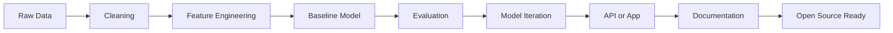
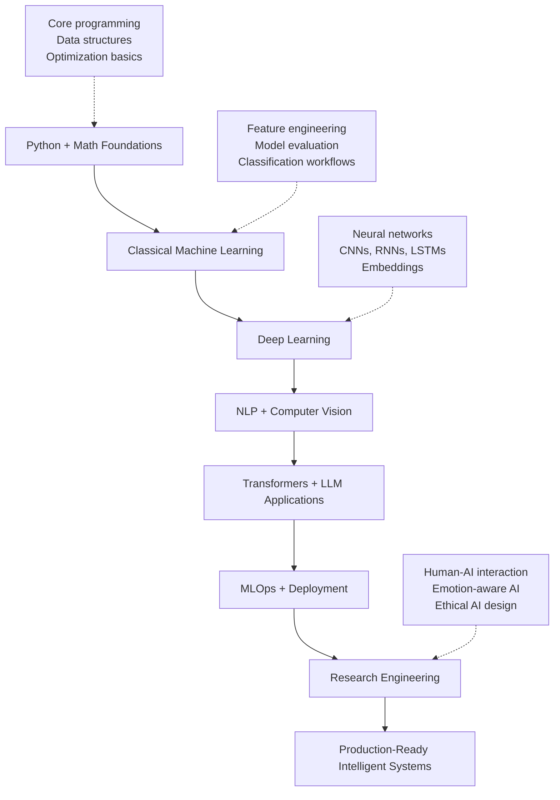

<!-- ═══════════════════════════════════════════════════════════════════════════════
      ███╗   ███╗ █████╗ ██╗  ██╗███████╗███████╗██╗  ██╗   ██████╗ ███████╗██████╗
      ████╗ ████║██╔══██╗██║  ██║██╔════╝██╔════╝██║  ██║   ██╔══██╗██╔════╝██╔══██╗
      ██╔████╔██║███████║███████║█████╗  ███████╗███████║   ██████╔╝█████╗  ██║  ██║
      ██║╚██╔╝██║██╔══██║██╔══██║██╔══╝  ╚════██║██╔══██║   ██╔══██╗██╔══╝  ██║  ██║
      ██║ ╚═╝ ██║██║  ██║██║  ██║███████╗███████║██║  ██║   ██║  ██║███████╗██████╔╝
      ╚═╝     ╚═╝╚═╝  ╚═╝╚═╝  ╚═╝╚══════╝╚══════╝╚═╝  ╚═╝   ╚═╝  ╚═╝╚══════╝╚═════╝
              A N I M A T E D   P R O F I L E   ·   M A X I M A L   M O T I O N
     ═══════════════════════════════════════════════════════════════════════════════ -->

<div align="center">

<!-- ░░░░░░░░░░░░░░░░░░░░ HERO ░░░░░░░░░░░░░░░░░░░░ -->


<!-- Animated headline typing -->


<br />

<!-- Primary links -->
<a href="https://github.com/MaheshReddy-ML"></a>
<a href="https://maheshreddyml.netlify.app"></a>
<a href="https://www.linkedin.com/in/maheshreddy04"></a>
<a href="mailto:maheshreddygit@gmail.com"></a>

<br />

<!-- Live counters -->


<br /><br />

<!-- Fast status ticker -->


<br /><br />

<!-- Full-bleed animated neon banner -->


<!-- Live coding GIF strip -->


<br />

<!-- Animated neon separator -->


</div>

<!-- ░░░ WAVE DIVIDER ░░░ -->


<div align="center">

<!-- ░░░░░░░░░░ SIGNAL LAYER ░░░░░░░░░░ -->


<table>
  <tr>
    <td align="center" width="33%">
      
      <br /><b>Build Mode</b><br />
      <sub>Turning ideas into working ML systems</sub>
    </td>
    <td align="center" width="33%">
      
      <br /><b>Research Mode</b><br />
      <sub>Testing, measuring, documenting, improving</sub>
    </td>
    <td align="center" width="33%">
      
      <br /><b>Open Source Mode</b><br />
      <sub>Shipping public work and learning in the open</sub>
    </td>
  </tr>
</table>


</div>

<!-- ░░░ GRADIENT DIVIDER ░░░ -->


<div align="center">

<!-- ░░░░░░░░░░ MISSION CONTROL ░░░░░░░░░░ -->


</div>

<table>
  <tr>
    <td width="58%">
      <h3>AI/ML undergraduate building practical intelligent systems</h3>
      <p>
        I am <b>Mahesh Reddy</b>, a <b>B.Tech Computer Science - Artificial Intelligence</b> student at
        <b>Parul University</b>, expected to graduate in <b>May 2027</b>.
      </p>
      <p>
        My work lives at the intersection of machine learning fundamentals, deep learning systems, NLP,
        computer vision, open-source engineering, and human-centered AI research.
      </p>
      <p>
        I like building projects that go beyond notebooks: from-scratch GPTs, clean data pipelines,
        model evaluation, deployed APIs, and documentation someone else can actually use.
      </p>
    </td>
    <td width="42%" align="center">
      
    </td>
  </tr>
</table>

| Status | Details |
| --- | --- |
| Current role | AI/ML Engineer in progress, research builder, open-source contributor |
| Education | B.Tech CSE - Artificial Intelligence, Parul University |
| Graduation | Expected May 2027 |
| Location | Andhra Pradesh, India |
| Open source | GirlScript Summer of Code 2026 selected contributor |
| Portfolio | [maheshreddyml.netlify.app](https://maheshreddyml.netlify.app) |
| GitHub | [github.com/MaheshReddy-ML](https://github.com/MaheshReddy-ML) |

<!-- ░░░ WAVE DIVIDER ░░░ -->


<div align="center">

<!-- ░░░░░░░░░░ WHAT I BUILD ░░░░░░░░░░ -->


</div>

<table>
  <tr>
    <td align="center" width="25%">
      
      <br /><br />Classification, regression, feature engineering, evaluation, pipelines, reproducible experiments.
    </td>
    <td align="center" width="25%">
      
      <br /><br />Transformers, CNNs, RNNs, LSTMs, embeddings, custom training loops, GPTs from scratch.
    </td>
    <td align="center" width="25%">
      
      <br /><br />BPE tokenizers, Word2Vec, text classification, chatbots, language modeling, memory-aware AI.
    </td>
    <td align="center" width="25%">
      
      <br /><br />Image preprocessing, gesture recognition, real-time inference, CNNs, accessibility-focused AI.
    </td>
  </tr>
</table>

<table>
  <tr>
    <td align="center" width="33%">
      
      <br /><br />Pull requests, issue solving, code review, repository hygiene, collaborative engineering.
    </td>
    <td align="center" width="33%">
      
      <br /><br />Human-AI interaction, emotionally aware AI, ethical system design, memory stability.
    </td>
    <td align="center" width="33%">
      
      <br /><br />REST APIs, FastAPI + MongoDB services, dashboards, live apps, readable documentation.
    </td>
  </tr>
</table>

<!-- ░░░ WAVE DIVIDER ░░░ -->


<div align="center">

<!-- ░░░░░░░░░░ TECH CONSTELLATION ░░░░░░░░░░ -->


<h3>Core Languages</h3>


<h3>AI, ML, Deep Learning &amp; Data</h3>


<h3>Backend &amp; Deployment</h3>


<h3>Engineering Tools</h3>


<br /><br />


</div>

<!-- ░░░ WAVE DIVIDER ░░░ -->


<div align="center">

<!-- ░░░░░░░░░░ GITHUB COMMAND CENTER ░░░░░░░░░░ -->


<br />


<br />


<br />


</div>

<!-- ░░░ WAVE DIVIDER ░░░ -->


<div align="center">

<!-- ░░░░░░░░░░ ACHIEVEMENT WALL ░░░░░░░░░░ -->


<br />


<br /><br />


<br />


<br /><br />

<!-- Live trophy service — renders automatically when github-profile-trophy recovers -->


</div>

<!-- ░░░ WAVE DIVIDER ░░░ -->


<div align="center">

<!-- ░░░░░░░░░░ SIGNATURE PROJECTS ░░░░░░░░░░ -->


</div>

<table>
  <tr>
    <td width="50%">
      <h3><a href="https://github.com/MaheshReddy-ML/MiniGPT-Emotional-Support">MiniGPT — Emotional Support</a></h3>
      <p><b>A GPT-style transformer, built from scratch</b></p>
      <p>Modern decoder architecture hand-built in PyTorch, a custom 16k BPE tokenizer, and 52,137 emotional-support dialogue pairs. V2 is a genuinely conversational support chatbot.</p>
      <p>
        
        
        
        
      </p>
    </td>
    <td width="50%">
      <h3><a href="https://github.com/MaheshReddy-ML/AI-Companion">AI-Companion · Emora</a></h3>
      <p><b>A living, emotionally aware AI companion</b></p>
      <p>Production-ready FastAPI + MongoDB system with multimodal emotion perception, contextual memory, and stable character modeling — so the AI remembers the person, not just the prompt.</p>
      <p>
        
        
        
      </p>
    </td>
  </tr>
  <tr>
    <td width="50%">
      <h3><a href="https://github.com/MaheshReddy-ML/customer-intelligence-system">Customer Intelligence System</a></h3>
      <p><b>Segmentation &amp; recommendation intelligence</b></p>
      <p>RFM signals, K-Means, neural embeddings, PCA/t-SNE visuals, and evaluation-backed business recommendations over raw retail transactions.</p>
      <p>
        
        
        
      </p>
    </td>
    <td width="50%">
      <h3><a href="https://github.com/MaheshReddy-ML/Student-Performance-Risk-Portal">Student Performance Risk Portal</a></h3>
      <p><b>Production-style academic risk app · live on Render</b></p>
      <p>Behavioral inputs → risk level, confidence score, top risk factors, and recommendations. scikit-learn pipeline behind a REST API and a polished single-page frontend.</p>
      <p>
        
        
        
      </p>
    </td>
  </tr>
  <tr>
    <td width="50%">
      <h3><a href="https://github.com/MaheshReddy-ML/lstm-chatbot-word2vec">LSTM Chatbot with Word2Vec</a></h3>
      <p><b>Conversational AI, the pre-transformer way</b></p>
      <p>A study of dialogue before transformers: Word2Vec learns word semantics, an LSTM learns sequential structure, and together they generate chat-like responses.</p>
      <p>
        
        
        
      </p>
    </td>
    <td width="50%">
      <h3><a href="https://github.com/MaheshReddy-ML/Sign_language_detecttion">Sign Language Detection</a></h3>
      <p><b>Real-time gesture classification</b></p>
      <p>A baseline CNN extended with a transformer-style SignFormer, plus real-time webcam inference via MediaPipe hand landmarks — full alphabet recognition.</p>
      <p>
        
        
        
      </p>
    </td>
  </tr>
</table>

<div align="center">


</div>

| Project | Focus | Repository |
| --- | --- | --- |
| **myMLlib** | ML algorithms from scratch on pure NumPy | [Open Repo](https://github.com/MaheshReddy-ML/myMLlib) |
| **EmailFilterAI** | TF-IDF + neural spam classifier (98.65%) | [Open Repo](https://github.com/MaheshReddy-ML/EmailFilterAI) |
| **F1-Pit** | CatBoost pit-stop prediction, GroupKFold | [Open Repo](https://github.com/MaheshReddy-ML/F1-Pit) |
| **Breast-Cancer-Detection** | Logistic regression from scratch (92%+) | [Open Repo](https://github.com/MaheshReddy-ML/Breast-Cancer-Detection) |
| **shakespeare-text-generator-lstm** | Character-level generative text | [Open Repo](https://github.com/MaheshReddy-ML/shakespeare-text-generator-lstm) |
| **Hyderabad_House_Rent_Predictor** | Zero-dependency rent prediction | [Open Repo](https://github.com/MaheshReddy-ML/Hyderabad_House_Rent_Predictor) |

<!-- ░░░ WAVE DIVIDER ░░░ -->


<div align="center">

<!-- ░░░░░░░░░░ OPEN SOURCE LOG ░░░░░░░░░░ -->


</div>

<table>
  <tr>
    <td width="35%" align="center">
      
      <br /><br />
      
      <br /><br />
      
    </td>
    <td width="65%">
      <ul>
        <li>Selected contributor in <b>GirlScript Summer of Code 2026</b>.</li>
        <li>Merged <b>PR #246</b> in <code>aliviahossain/Disease-prediction</code>, adding a standardized preprocessing module under <code>backend/preprocessing</code>.</li>
        <li>Submitted <b>PR #338</b> for <code>SdSarthak/AegisAI</code>, focused on a standardized ML training pipeline for Guard Safety Prediction.</li>
        <li>Practicing code review, issue resolution, iterative feedback, and production-oriented repository structure.</li>
      </ul>
    </td>
  </tr>
</table>

<!-- ░░░ WAVE DIVIDER ░░░ -->


<div align="center">

<!-- ░░░░░░░░░░ RESEARCH LAB ░░░░░░░░░░ -->


</div>

<table>
  <tr>
    <td width="50%">
      <h3>Emotionally Aware AI Companions</h3>
      <p><b>First Author</b> | Department of AI and Data Science, Parul University</p>
      <p>
        A human-centric methodology for AI companions combining multimodal emotion perception,
        contextual memory management, stable character modeling, and ethical AI design — realized in the Emora build.
      </p>
      <p>
        
        
        
      </p>
    </td>
    <td width="50%">
      <h3>Feature Scaling and Gradient Descent</h3>
      <p><b>Independent Researcher</b> | Breast Cancer Detection Case Study</p>
      <p>
        Empirical study of min-max normalization and standardization effects on gradient descent convergence
        and logistic regression accuracy using a from-scratch Python/NumPy pipeline.
      </p>
      <p>
        
        
        
      </p>
    </td>
  </tr>
</table>

<!-- ░░░ WAVE DIVIDER ░░░ -->


<div align="center">

<!-- ░░░░░░░░░░ ENGINEERING OPERATING SYSTEM ░░░░░░░░░░ -->


</div>



```yaml
engineering_principles:
  - understand_the_data_before_modeling
  - build_a_clear_baseline_first
  - make_preprocessing_reproducible
  - evaluate_with_metrics_that_match_the_problem
  - expose_predictions_through_clean_interfaces
  - document_the_project_like_someone_else_will_use_it
  - keep_learning_from_research_and_open_source
```

<!-- ░░░ WAVE DIVIDER ░░░ -->


<div align="center">

<!-- ░░░░░░░░░░ LEARNING ROADMAP ░░░░░░░░░░ -->


</div>



<div align="center">


</div>

<!-- ░░░ WAVE DIVIDER ░░░ -->


<div align="center">

<!-- ░░░░░░░░░░ EDUCATION + CREDENTIALS ░░░░░░░░░░ -->


</div>

<table>
  <tr>
    <th>Program</th>
    <th>Institution</th>
    <th>Timeline</th>
  </tr>
  <tr>
    <td><b>B.Tech in Computer Science - Artificial Intelligence</b></td>
    <td>Parul University, Gujarat, India</td>
    <td>Expected May 2027</td>
  </tr>
  <tr>
    <td><b>Senior Secondary Education - Science</b></td>
    <td>Sri Chaitanya, Andhra Pradesh, India</td>
    <td>2023</td>
  </tr>
</table>

<p align="center">
  
  
  
</p>

<details>
  <summary><b>Coursework and foundations</b></summary>
  <br />
  <p>
    Machine Learning, Deep Learning, Artificial Neural Networks, Natural Language Processing,
    Computer Vision, Data Structures and Algorithms, Object-Oriented Programming, Database Management Systems.
  </p>
</details>

<details>
  <summary><b>Technical writing themes</b></summary>
  <br />
  <p>
    Gradient descent mechanics, building ML models from scratch, GPT architecture design,
    AI companion systems, emotionally aware AI, and ethical AI system design.
  </p>
</details>

<!-- ░░░ WAVE DIVIDER ░░░ -->


<div align="center">

<!-- ░░░░░░░░░░ REPOSITORY MAP ░░░░░░░░░░ -->


</div>

| Repository | Focus | Stack |
| --- | --- | --- |
| [MiniGPT-Emotional-Support](https://github.com/MaheshReddy-ML/MiniGPT-Emotional-Support) | GPT-style transformer from scratch | Python, PyTorch, BPE |
| [AI-Companion](https://github.com/MaheshReddy-ML/AI-Companion) | Emotion-aware AI companion (Emora) | Python, FastAPI, MongoDB |
| [customer-intelligence-system](https://github.com/MaheshReddy-ML/customer-intelligence-system) | Segmentation, embeddings, recommendations | Python, TensorFlow, scikit-learn |
| [Student-Performance-Risk-Portal](https://github.com/MaheshReddy-ML/Student-Performance-Risk-Portal) | Academic risk prediction web app | Python, scikit-learn, REST API |
| [Sign_language_detecttion](https://github.com/MaheshReddy-ML/Sign_language_detecttion) | Real-time sign language recognition | Python, TensorFlow, MediaPipe |
| [lstm-chatbot-word2vec](https://github.com/MaheshReddy-ML/lstm-chatbot-word2vec) | Conversational AI, sequence modeling | Python, LSTM, Word2Vec |
| [myMLlib](https://github.com/MaheshReddy-ML/myMLlib) | ML algorithms from scratch | Python, NumPy |
| [EmailFilterAI](https://github.com/MaheshReddy-ML/EmailFilterAI) | Neural spam classification | Python, TF-IDF |
| [shakespeare-text-generator-lstm](https://github.com/MaheshReddy-ML/shakespeare-text-generator-lstm) | Generative text modeling | Python, LSTM, NLP |
| [F1-Pit](https://github.com/MaheshReddy-ML/F1-Pit) | F1 pit-stop prediction | Python, CatBoost |
| [Breast-Cancer-Detection](https://github.com/MaheshReddy-ML/Breast-Cancer-Detection) | Logistic regression from scratch | Python, NumPy |
| [Hyderabad_House_Rent_Predictor](https://github.com/MaheshReddy-ML/Hyderabad_House_Rent_Predictor) | House rent prediction | Python |

<!-- ░░░ WAVE DIVIDER ░░░ -->


<div align="center">

<!-- ░░░░░░░░░░ CONTRIBUTION SNAKE (kept identical) ░░░░░░░░░░ -->


<picture>
  <source media="(prefers-color-scheme: dark)" srcset="https://raw.githubusercontent.com/MaheshReddy-ML/Maheshreddy-ML/output/github-contribution-grid-snake-dark.svg" />
  <source media="(prefers-color-scheme: light)" srcset="https://raw.githubusercontent.com/MaheshReddy-ML/Maheshreddy-ML/output/github-contribution-grid-snake.svg" />
  
</picture>

</div>

<!-- ░░░ WAVE DIVIDER ░░░ -->


<div align="center">

<!-- ░░░░░░░░░░ CONNECT ░░░░░░░░░░ -->


<br />


<br />

<a href="mailto:maheshreddygit@gmail.com"></a>
<a href="https://www.linkedin.com/in/maheshreddy04"></a>
<a href="https://github.com/MaheshReddy-ML"></a>
<a href="https://maheshreddyml.netlify.app"></a>

<br /><br />


<br />

<!-- ░░░ FOOTER WAVE ░░░ -->


<sub>Thanks for scrolling to the end of the map. ✦</sub>

</div>
