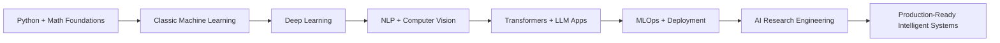

<div align="center">


<a href="https://git.io/typing-svg">
  
</a>

<br />

<a href="https://github.com/MaheshReddy-ML">
  
</a>
<a href="https://github.com/MaheshReddy-ML?tab=followers">
  
</a>
<a href="https://maheshreddyml.netlify.app">
  
</a>
<a href="mailto:maheshreddygit@gmail.com">
  
</a>
<a href="https://www.linkedin.com/in/maheshreddy04">
  
</a>

</div>

---

##  About Me

I am **Mahesh Reddy**, an **AI/ML undergraduate** pursuing **B.Tech in Computer Science - Artificial Intelligence** at **Parul University**, expected to graduate in **May 2027**.

I build machine learning systems end to end: from raw data, preprocessing, feature engineering, model training, evaluation, and deployment to clean documentation and usable interfaces. My core interests are **Machine Learning**, **Deep Learning**, **NLP**, **Computer Vision**, **Transformers**, **LLM applications**, **AI research engineering**, and **production-style ML workflows**.

I am also a **GirlScript Summer of Code 2026 selected contributor**, a **published AI researcher**, and the creator of **myMLlib**, a custom open-source machine learning library built from scratch using Python and NumPy.

<br />

| Focus | What I Like Building |
| --- | --- |
| Machine Learning | Classification systems, feature pipelines, model evaluation, tabular ML |
| Deep Learning | Neural networks, CNNs, RNNs, LSTMs, embeddings, sequence models |
| NLP | TF-IDF, Word2Vec, tokenization, text classification, chatbots, language modeling |
| Computer Vision | Image classification, real-time gesture detection, preprocessing pipelines |
| Research | Human-AI interaction, emotionally aware AI, ethical AI, memory stability |
| Engineering | REST APIs, clean project structure, reproducible ML workflows, open source |

---

##  Current Status

```yaml
name: Mahesh Reddy
role: AI/ML Engineer | Researcher | Open Source Contributor
education: B.Tech CSE - Artificial Intelligence, Parul University
graduation: May 2027
location: Andhra Pradesh, India
open_source: GirlScript Summer of Code 2026 Selected Contributor
portfolio: maheshreddyml.netlify.app
github: github.com/MaheshReddy-ML
linkedin: linkedin.com/in/maheshreddy04
email: maheshreddygit@gmail.com
```

---

##  Tech Stack

### Languages

<p>
  
</p>

### AI, ML, Data, and Research

<p>
  
  
  
  
  
  
</p>

### Frameworks and Libraries

<p>
  
</p>

<p>
  
  
  
  
  
  
</p>

### Tools and Platforms

<p>
  
</p>

<p>
  
  
  
  
</p>

---

##  GitHub Analytics

<div align="center">


<br />


<br />


</div>

---

##  GitHub Achievements

<div align="center">


</div>

---

## Featured Projects

<div align="center">

<a href="https://github.com/MaheshReddy-ML/myMLlib">
  
</a>
<a href="https://github.com/MaheshReddy-ML/EmailFilterAI">
  
</a>
<a href="https://github.com/MaheshReddy-ML/customer-intelligence-system">
  
</a>
<a href="https://github.com/MaheshReddy-ML/Student-Performance-Risk-Portal">
  
</a>
<a href="https://github.com/MaheshReddy-ML/Sign_language_detecttion">
  
</a>
<a href="https://github.com/MaheshReddy-ML/lstm-chatbot-word2vec">
  
</a>

</div>

---

## Project Highlights

### myMLlib - Custom Machine Learning Library

> A from-scratch open-source machine learning library built with Python and NumPy.

<p>
  
  
  
  
</p>

- Designed a modular ML library from scratch using only Python and NumPy.
- Implemented logistic regression, gradient descent, feature scaling, and binary classification metrics.
- Built the architecture so new algorithms can be added independently without breaking existing modules.
- Focused on understanding ML internals, not just calling high-level APIs.

### EmailFilterAI - Neural Network Spam Classifier

> NLP-powered email spam classification using TF-IDF and neural networks.

<p>
  
  
  
  
</p>

- Built a full spam detection system with preprocessing, vectorization, training, and inference.
- Achieved **98.65% test accuracy** and **98-99% validation accuracy**.
- Evaluated results with confusion matrix, precision, recall, and F1-score.
- Generated per-email probability scores for more interpretable predictions.

### Customer Intelligence System

> End-to-end customer segmentation, embedding analysis, and recommendation intelligence for retail behavior data.

<p>
  
  
  
  
</p>

- Converts retail transaction data into customer-level behavioral features.
- Builds RFM-style signals such as recency, frequency, monetary value, quantity, and average unit price.
- Evaluates K-Means with inertia and silhouette scores.
- Trains baseline Random Forest and neural network segmentation models.
- Extracts learned customer embeddings, clusters them, and maps segments to readable business recommendations.

### Student Performance Risk Portal

> A deployed ML web app for predicting academic risk from behavioral and lifestyle features.

<p>
  
  
  
  
</p>

- Predicts **Low**, **Medium**, or **High** student academic risk with confidence scores.
- Uses features like study hours, attendance, sleep, social media usage, exercise, diet, and mental health rating.
- Includes `/api/predict` and `/api/health` endpoints.
- Returns risk level, probability distribution, top influencing factors, and actionable recommendations.
- Deployed as a production-style single-page application.

### LSTM Chatbot with Word2Vec Embeddings

> End-to-end conversational AI using recurrent neural networks and semantic embeddings.

<p>
  
  
  
  
</p>

- Built a chatbot using LSTM recurrent neural networks.
- Trained Word2Vec embeddings to capture semantic relationships between words.
- Implemented tokenization, embedding training, sequence modeling, and response generation.
- Strengthened NLP understanding through sequence-based architecture design.

### Sign Language Detection System

> Real-time sign language gesture classification using deep learning and computer vision.

<p>
  
  
  
  
</p>

- Built a sign-language gesture classifier for gesture-to-text recognition.
- Created image preprocessing and feature extraction workflows.
- Combined CNN-based classification with real-time webcam inference.
- Extended the project with a transformer-style SignFormer model.

### F1 Pit Prediction

> Kaggle-style F1 pit-stop prediction using telemetry and race-aware features.

<p>
  
  
  
  
</p>

- Predicts whether an F1 car will pit on the next lap.
- Uses telemetry, tyre condition, race progress, lap performance, and engineered race-pressure features.
- Trains CatBoost with group-aware cross-validation by race.
- Tunes thresholds to maximize F1 score and generate stable test predictions.

### Breast Cancer Detection

> Logistic regression from scratch for breast cancer classification.

<p>
  
  
  
  
</p>

- Implemented logistic regression and gradient descent with no ML frameworks.
- Studied how feature scaling affects convergence and model performance.
- Achieved **92%+ accuracy** on the Breast Cancer Wisconsin dataset.
- Turned the project into a technical research-style case study.

---

## Open Source

<div align="center">


</div>

### GirlScript Summer of Code 2026

- Selected contributor in **GSSoC'26**, one of India's largest open-source programs.
- Merged **PR #246** in `aliviahossain/Disease-prediction`, adding a standardized preprocessing module under `backend/preprocessing`.
- Designed and submitted **PR #338** for `SdSarthak/AegisAI`, focused on a standardized ML training pipeline for Guard Safety Prediction.
- Practicing issue resolution, reviewer feedback loops, production-oriented code structure, and collaborative GitHub workflows.

---

## Research and Publications

### Emotionally Aware AI Companions: A Human-Centric Methodological Approach

**First Author** | Department of AI and Data Science, Parul University

- Proposed a modular architecture for emotionally aware AI companions.
- Integrated multimodal emotion perception, contextual memory management, and stable character modeling.
- Addressed the **LLM Goldfish Memory problem** through memory-aware design.
- Formalized a mathematical stability constraint on emotional transitions between conversational turns.
- Focused on ethical AI safety, transparency, emotional dependency prevention, privacy minimization, and bias mitigation.

### Feature Scaling and Gradient Descent in Logistic Regression

**Independent Researcher** | Breast Cancer Detection Case Study

- Studied min-max normalization and standardization in gradient descent convergence.
- Built the full logistic regression pipeline from scratch in Python and NumPy.
- Evaluated performance on the Breast Cancer Wisconsin dataset.
- Achieved **92%+ accuracy** while focusing on interpretability and algorithm fundamentals.

---

## Learning Roadmap



### Currently Exploring

- Advanced NLP and transformer architectures
- LLM application design and memory-aware systems
- MLOps fundamentals and deployment workflows
- Reliable evaluation for ML and deep learning systems
- AI safety, human-AI interaction, and ethical AI design
- Open-source collaboration at production quality

---

## How I Think About AI Engineering

```text
Understand the data
        |
        v
Build a clear baseline
        |
        v
Improve preprocessing and features
        |
        v
Train, evaluate, and compare models
        |
        v
Make predictions explainable
        |
        v
Package the workflow cleanly
        |
        v
Deploy or document it so others can use it
```

I like projects where the model is only one part of the system. A useful AI project also needs clean inputs, reliable evaluation, thoughtful outputs, documentation, reproducibility, and a path for real users or developers to interact with it.

---

## Education

<table>
  <tr>
    <td><b>B.Tech in Computer Science - Artificial Intelligence</b></td>
    <td>Parul University, Gujarat, India</td>
    <td>Expected May 2027</td>
  </tr>
  <tr>
    <td><b>Senior Secondary Education - Science</b></td>
    <td>Sri Chaitanya, Andhra Pradesh, India</td>
    <td>2023</td>
  </tr>
</table>

### Relevant Coursework

<p>
  
  
  
  
  
  
  
  
</p>

---

## Certifications and Writing

- **CS50: Introduction to Programming with Python** - Harvard University / edX, 2025
- Technical writing at **[maheshreddyml.netlify.app](https://maheshreddyml.netlify.app)**
- Topics include gradient descent, ML from scratch, NLP architecture design, AI companion systems, and ethical AI design.

---

## Repositories Snapshot

| Repository | Focus | Stack |
| --- | --- | --- |
| [customer-intelligence-system](https://github.com/MaheshReddy-ML/customer-intelligence-system) | Customer segmentation, embeddings, recommendations | Python, TensorFlow, scikit-learn, Pandas |
| [myMLlib](https://github.com/MaheshReddy-ML/myMLlib) | ML algorithms from scratch | Python, NumPy |
| [EmailFilterAI](https://github.com/MaheshReddy-ML/EmailFilterAI) | Spam classification | Python, TF-IDF, Neural Network |
| [Student-Performance-Risk-Portal](https://github.com/MaheshReddy-ML/Student-Performance-Risk-Portal) | Academic risk prediction web app | Python, scikit-learn, REST API, HTML/CSS/JS |
| [Sign_language_detecttion](https://github.com/MaheshReddy-ML/Sign_language_detecttion) | Sign language recognition | Python, TensorFlow, Keras, OpenCV |
| [lstm-chatbot-word2vec](https://github.com/MaheshReddy-ML/lstm-chatbot-word2vec) | Conversational AI | Python, TensorFlow, LSTM, Word2Vec |
| [shakespeare-text-generator-lstm](https://github.com/MaheshReddy-ML/shakespeare-text-generator-lstm) | Generative text modeling | Python, LSTM, NLP |
| [F1-Pit](https://github.com/MaheshReddy-ML/F1-Pit) | F1 pit-stop prediction | Python, CatBoost, GroupKFold |
| [Breast-Cancer-Detection](https://github.com/MaheshReddy-ML/Breast-Cancer-Detection) | Logistic regression from scratch | Python, NumPy |
| [Hyderabad_House_Rent_Predictor](https://github.com/MaheshReddy-ML/Hyderabad_House_Rent_Predictor) | House rent prediction and ML practice | Python |

---

## Contribution Animation

<div align="center">

<picture>
  <source media="(prefers-color-scheme: dark)" srcset="https://raw.githubusercontent.com/MaheshReddy-ML/Maheshreddy-ML/output/github-contribution-grid-snake-dark.svg" />
  <source media="(prefers-color-scheme: light)" srcset="https://raw.githubusercontent.com/MaheshReddy-ML/Maheshreddy-ML/output/github-contribution-grid-snake.svg" />
  
</picture>

</div>

> Note: The contribution snake appears after adding a GitHub Action that generates it into the `output` branch. The README is already prepared for it.

---

## Connect With Me

<div align="center">

<a href="mailto:maheshreddygit@gmail.com">
  
</a>
<a href="https://www.linkedin.com/in/maheshreddy04">
  
</a>
<a href="https://github.com/MaheshReddy-ML">
  
</a>
<a href="https://maheshreddyml.netlify.app">
  
</a>

</div>

---

<div align="center">

<h3>"Building AI systems that are practical, explainable, and human-aware."</h3>


</div>
