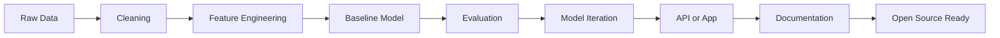
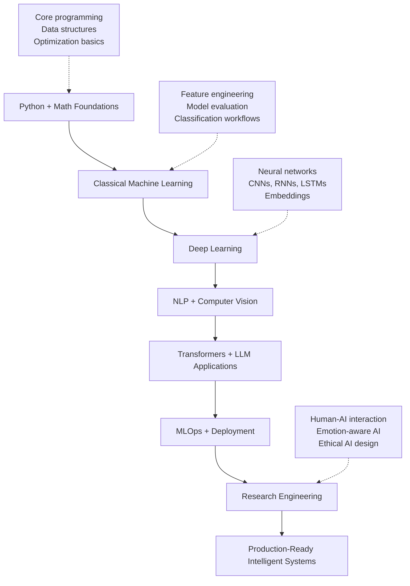

<div align="center">


<a href="https://git.io/typing-svg">
  
</a>

<br />

<a href="https://github.com/MaheshReddy-ML">
  
</a>
<a href="https://maheshreddyml.netlify.app">
  
</a>
<a href="https://www.linkedin.com/in/maheshreddy04">
  
</a>
<a href="mailto:maheshreddygit@gmail.com">
  
</a>

<br />


</div>

<br />

<div align="center">


</div>

## Mission Control

<table>
  <tr>
    <td width="58%">
      <h3>AI/ML undergraduate building practical intelligent systems</h3>
      <p>
        I am <b>Mahesh Reddy</b>, a <b>B.Tech Computer Science - Artificial Intelligence</b> student at
        <b>Parul University</b>, expected to graduate in <b>May 2027</b>.
      </p>
      <p>
        My work lives at the intersection of machine learning fundamentals, deep learning systems, NLP,
        computer vision, open-source engineering, and human-centered AI research.
      </p>
      <p>
        I like building projects that go beyond notebooks: clean data pipelines, model evaluation, APIs,
        deployment-ready structure, useful documentation, and readable outputs.
      </p>
    </td>
    <td width="42%" align="center">
      
    </td>
  </tr>
</table>

| Status | Details |
| --- | --- |
| Current role | AI/ML Engineer in progress, research builder, open-source contributor |
| Education | B.Tech CSE - Artificial Intelligence, Parul University |
| Graduation | Expected May 2027 |
| Location | Andhra Pradesh, India |
| Open source | GirlScript Summer of Code 2026 selected contributor |
| Portfolio | [maheshreddyml.netlify.app](https://maheshreddyml.netlify.app) |
| GitHub | [github.com/MaheshReddy-ML](https://github.com/MaheshReddy-ML) |

---

<div align="center">


</div>

<table>
  <tr>
    <td align="center" width="25%">
      
      <br /><br />
      Classification, regression, feature engineering, evaluation, pipelines, reproducible experiments.
    </td>
    <td align="center" width="25%">
      
      <br /><br />
      Neural networks, CNNs, RNNs, LSTMs, embeddings, sequence models, model training loops.
    </td>
    <td align="center" width="25%">
      
      <br /><br />
      TF-IDF, Word2Vec, tokenization, text classification, chatbots, language modeling, memory-aware AI.
    </td>
    <td align="center" width="25%">
      
      <br /><br />
      Image preprocessing, gesture recognition, real-time inference, CNNs, accessibility-focused AI.
    </td>
  </tr>
</table>

<table>
  <tr>
    <td align="center" width="33%">
      
      <br /><br />
      Pull requests, issue solving, code review feedback, repository hygiene, collaborative engineering.
    </td>
    <td align="center" width="33%">
      
      <br /><br />
      Human-AI interaction, emotionally aware AI, ethical system design, memory stability, behavioral regularization.
    </td>
    <td align="center" width="33%">
      
      <br /><br />
      REST APIs, dashboards, frontend integration, live apps, readable documentation, user-facing outputs.
    </td>
  </tr>
</table>

---

<div align="center">


</div>

<div align="center">

<h3>Core Languages</h3>


<h3>AI, ML, Data, and Backend</h3>


<h3>Engineering Tools</h3>


<br /><br />


</div>

---

<div align="center">


<br />


<br />


<br />


</div>

---

<div align="center">


</div>

---

<div align="center">


</div>

<table>
  <tr>
    <td width="50%">
      <h3><a href="https://github.com/MaheshReddy-ML/myMLlib">myMLlib</a></h3>
      <p><b>Custom ML library from scratch</b></p>
      <p>Python and NumPy implementation of core ML algorithms with no scikit-learn or TensorFlow dependency.</p>
      <p>
        
        
        
      </p>
    </td>
    <td width="50%">
      <h3><a href="https://github.com/MaheshReddy-ML/EmailFilterAI">EmailFilterAI</a></h3>
      <p><b>Neural spam classifier</b></p>
      <p>TF-IDF + neural network based email spam classification with 98.65% test accuracy.</p>
      <p>
        
        
        
      </p>
    </td>
  </tr>
  <tr>
    <td width="50%">
      <h3><a href="https://github.com/MaheshReddy-ML/customer-intelligence-system">Customer Intelligence System</a></h3>
      <p><b>Customer segmentation and recommendation intelligence</b></p>
      <p>RFM signals, K-Means, Random Forest baseline, neural embeddings, clustering visuals, and business recommendations.</p>
      <p>
        
        
        
      </p>
    </td>
    <td width="50%">
      <h3><a href="https://github.com/MaheshReddy-ML/Student-Performance-Risk-Portal">Student Performance Risk Portal</a></h3>
      <p><b>Production-style academic risk prediction app</b></p>
      <p>Behavioral inputs, scikit-learn classifier, REST API, confidence scores, top risk factors, and recommendations.</p>
      <p>
        
        
        
      </p>
    </td>
  </tr>
  <tr>
    <td width="50%">
      <h3><a href="https://github.com/MaheshReddy-ML/Sign_language_detecttion">Sign Language Detection</a></h3>
      <p><b>Real-time gesture classification</b></p>
      <p>CNN + SignFormer-style pipeline for sign-language letter classification and webcam inference.</p>
      <p>
        
        
        
      </p>
    </td>
    <td width="50%">
      <h3><a href="https://github.com/MaheshReddy-ML/lstm-chatbot-word2vec">LSTM Chatbot with Word2Vec</a></h3>
      <p><b>Conversational AI with sequence modeling</b></p>
      <p>Tokenization, Word2Vec embeddings, LSTM sequence learning, and natural language response generation.</p>
      <p>
        
        
        
      </p>
    </td>
  </tr>
  <tr>
    <td width="50%">
      <h3><a href="https://github.com/MaheshReddy-ML/F1-Pit">F1 Pit Prediction</a></h3>
      <p><b>Kaggle-style motorsport ML</b></p>
      <p>CatBoost classifier with race-aware features, GroupKFold validation, and threshold tuning for F1 score.</p>
      <p>
        
        
        
      </p>
    </td>
    <td width="50%">
      <h3><a href="https://github.com/MaheshReddy-ML/Breast-Cancer-Detection">Breast Cancer Detection</a></h3>
      <p><b>Logistic regression from scratch</b></p>
      <p>Feature scaling, gradient descent, and 92%+ accuracy on a real-world classification dataset.</p>
      <p>
        
        
        
      </p>
    </td>
  </tr>
</table>

<div align="center">

<a href="https://github.com/MaheshReddy-ML/myMLlib">
  
</a>
<a href="https://github.com/MaheshReddy-ML/EmailFilterAI">
  
</a>
<a href="https://github.com/MaheshReddy-ML/customer-intelligence-system">
  
</a>
<a href="https://github.com/MaheshReddy-ML/Student-Performance-Risk-Portal">
  
</a>
<a href="https://github.com/MaheshReddy-ML/Sign_language_detecttion">
  
</a>
<a href="https://github.com/MaheshReddy-ML/lstm-chatbot-word2vec">
  
</a>

</div>

---

<div align="center">


</div>

<table>
  <tr>
    <td width="35%" align="center">
      
      <br /><br />
      
      <br /><br />
      
    </td>
    <td width="65%">
      <ul>
        <li>Selected contributor in <b>GirlScript Summer of Code 2026</b>.</li>
        <li>Merged <b>PR #246</b> in <code>aliviahossain/Disease-prediction</code>, adding a standardized preprocessing module under <code>backend/preprocessing</code>.</li>
        <li>Submitted <b>PR #338</b> for <code>SdSarthak/AegisAI</code>, focused on a standardized ML training pipeline for Guard Safety Prediction.</li>
        <li>Practicing code review, issue resolution, iterative feedback, and production-oriented repository structure.</li>
      </ul>
    </td>
  </tr>
</table>

---

<div align="center">


</div>

<table>
  <tr>
    <td width="50%">
      <h3>Emotionally Aware AI Companions</h3>
      <p><b>First Author</b> | Department of AI and Data Science, Parul University</p>
      <p>
        A human-centric methodology for AI companions that combines multimodal emotion perception,
        contextual memory management, stable character modeling, and ethical AI design.
      </p>
      <p>
        
        
        
      </p>
    </td>
    <td width="50%">
      <h3>Feature Scaling and Gradient Descent</h3>
      <p><b>Independent Researcher</b> | Breast Cancer Detection Case Study</p>
      <p>
        Empirical study of min-max normalization and standardization effects on gradient descent convergence
        and logistic regression accuracy using a from-scratch Python/NumPy pipeline.
      </p>
      <p>
        
        
        
      </p>
    </td>
  </tr>
</table>

---

<div align="center">


</div>



```yaml
engineering_principles:
  - understand_the_data_before_modeling
  - build_a_clear_baseline_first
  - make_preprocessing_reproducible
  - evaluate_with_metrics_that_match_the_problem
  - expose_predictions_through_clean_interfaces
  - document_the_project_like_someone_else_will_use_it
  - keep_learning_from_research_and_open_source
```

---

<div align="center">


</div>



<div align="center">


</div>

---

<div align="center">


</div>

<table>
  <tr>
    <th>Program</th>
    <th>Institution</th>
    <th>Timeline</th>
  </tr>
  <tr>
    <td><b>B.Tech in Computer Science - Artificial Intelligence</b></td>
    <td>Parul University, Gujarat, India</td>
    <td>Expected May 2027</td>
  </tr>
  <tr>
    <td><b>Senior Secondary Education - Science</b></td>
    <td>Sri Chaitanya, Andhra Pradesh, India</td>
    <td>2023</td>
  </tr>
</table>

<p align="center">
  
  
  
</p>

<details>
  <summary><b>Coursework and foundations</b></summary>
  <br />
  <p>
    Machine Learning, Deep Learning, Artificial Neural Networks, Natural Language Processing,
    Computer Vision, Data Structures and Algorithms, Object-Oriented Programming, Database Management Systems.
  </p>
</details>

<details>
  <summary><b>Technical writing themes</b></summary>
  <br />
  <p>
    Gradient descent mechanics, building ML models from scratch, NLP architecture design,
    AI companion systems, emotionally aware AI, and ethical AI system design.
  </p>
</details>

---

<div align="center">


</div>

| Repository | Focus | Stack |
| --- | --- | --- |
| [customer-intelligence-system](https://github.com/MaheshReddy-ML/customer-intelligence-system) | Customer segmentation, embeddings, recommendations | Python, TensorFlow, scikit-learn, Pandas |
| [myMLlib](https://github.com/MaheshReddy-ML/myMLlib) | ML algorithms from scratch | Python, NumPy |
| [EmailFilterAI](https://github.com/MaheshReddy-ML/EmailFilterAI) | Spam classification | Python, TF-IDF, Neural Network |
| [Student-Performance-Risk-Portal](https://github.com/MaheshReddy-ML/Student-Performance-Risk-Portal) | Academic risk prediction web app | Python, scikit-learn, REST API, HTML/CSS/JS |
| [Sign_language_detecttion](https://github.com/MaheshReddy-ML/Sign_language_detecttion) | Sign language recognition | Python, TensorFlow, Keras, OpenCV |
| [lstm-chatbot-word2vec](https://github.com/MaheshReddy-ML/lstm-chatbot-word2vec) | Conversational AI | Python, TensorFlow, LSTM, Word2Vec |
| [shakespeare-text-generator-lstm](https://github.com/MaheshReddy-ML/shakespeare-text-generator-lstm) | Generative text modeling | Python, LSTM, NLP |
| [F1-Pit](https://github.com/MaheshReddy-ML/F1-Pit) | F1 pit-stop prediction | Python, CatBoost, GroupKFold |
| [Breast-Cancer-Detection](https://github.com/MaheshReddy-ML/Breast-Cancer-Detection) | Logistic regression from scratch | Python, NumPy |
| [Hyderabad_House_Rent_Predictor](https://github.com/MaheshReddy-ML/Hyderabad_House_Rent_Predictor) | House rent prediction and ML practice | Python |
| [Kaggle](https://github.com/MaheshReddy-ML/Kaggle) | Competition and practice work | Python |
| [Maheshreddy-ML](https://github.com/MaheshReddy-ML/Maheshreddy-ML) | Portfolio website | HTML, CSS, JavaScript |

---

<div align="center">


<picture>
  <source media="(prefers-color-scheme: dark)" srcset="https://raw.githubusercontent.com/MaheshReddy-ML/Maheshreddy-ML/output/github-contribution-grid-snake-dark.svg" />
  <source media="(prefers-color-scheme: light)" srcset="https://raw.githubusercontent.com/MaheshReddy-ML/Maheshreddy-ML/output/github-contribution-grid-snake.svg" />
  
</picture>

<br />

<sub>This animated contribution graph appears after the GitHub Action generates the SVG into the output branch.</sub>

</div>

---

<div align="center">


<a href="mailto:maheshreddygit@gmail.com">
  
</a>
<a href="https://www.linkedin.com/in/maheshreddy04">
  
</a>
<a href="https://github.com/MaheshReddy-ML">
  
</a>
<a href="https://maheshreddyml.netlify.app">
  
</a>

<br /><br />


<br />


</div>
